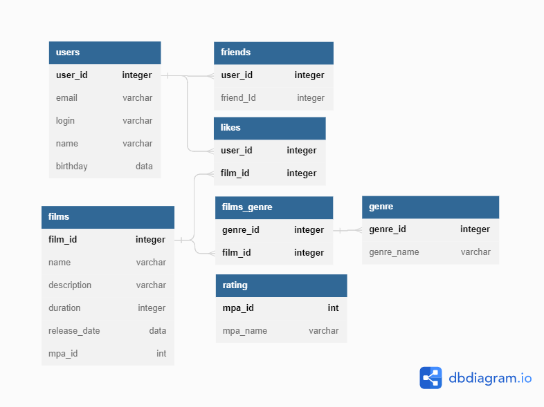

# java-filmorate

## Схема базы данных и примеры запросов

1. Созданы таблиы users, films, genre и rating;
2. Тип связи между пользователями -
   "Многие к многим". Для этого создана
   таблица friends;
3. Тип связи между пользователями
   и фильмами - "Многие к многим". Для этого
   создана таблица likes;
4. Тип связи между фильмами и жанрами -
   "Многие к многим". Для этого создана
   таблица films_genre;
5. Тип связи между рейтингом и фильмом -
   "Один к многим".
